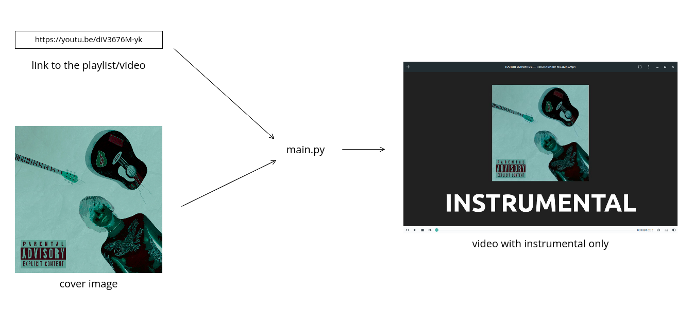

# make-instrumental-video



Given a list of links to some YouTube videos and a cover image, the script does the following things:
1. Generates an image for making static video using `template.png` and given cover image 

for every video (in every playlist) it does this:

2. Downloads the video and extracts audio from it using [yt-dlp](https://github.com/yt-dlp/yt-dlp)
3. Runs ~~[spleeter](https://github.com/deezer/spleeter)~~ [demucs](https://github.com/facebookresearch/demucs) on this 
   audio, 
   getting an instrumental
4. Runs [ffmpeg](https://github.com/FFmpeg/FFmpeg) to create static video from the instrumental (see 3) and the image (see 1)

### Additional features
- You can use a directory with mp3s as a source for songs with `--mp3-dir`
- You can make mp3s instead of mp4s, just omit the cover image path

### Prerequisites

1. python3.9
2. python3.9-venv
3. python3.9-dev (possibly)
4. ffmpeg

### Usage

```bash
python3.9 -m venv venv
source venv/bin/activate
pip install -r requirements.txt 
python3 main.py <links_to_yt> --cover <path_to_cover_image>
```